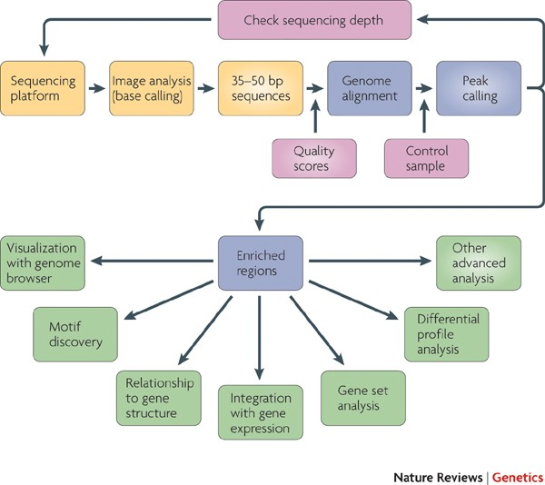

```{r setup, include=FALSE}
knitr::opts_chunk$set(echo = TRUE,message=FALSE)
```
# Hands-on chip-seq Analysis in Galaxy and R

### Sheffield Bioinformatics Core


web : [sbc.shef.ac.uk](http://sbc.shef.ac.uk)  
twitter: [SheffBioinfCore](https://twitter.com/SheffBioinfCore)  
email: [bioinformatics-core@sheffield.ac.uk](bioinformatics-core@sheffield.ac.uk)

-----

# Acknowledgement

Some of these materials are based on courses available at .

- [ATAC-Seq data analysis in Galaxy](https://training.galaxyproject.org/training-material/topics/epigenetics/tutorials/atac-seq/tutorial.html/)
- [Chip-seq excersizes in R by Jonas Ibn-Salem, JGU Mainz](http://cbdm-01.zdv.uni-mainz.de/~jibnsale/teaching/chip-seq_exercises.html)
- [The ChIPpeakAnno user’s guide by Jianhong Ou, Jun Yu, Lihua Julie Zhu](https://www.bioconductor.org/packages/release/bioc/vignettes/ChIPpeakAnno/inst/doc/ChIPpeakAnno.html)

-----

# Tutorial overview
This tutorial will continue the analysis of the ChIP-seq peak data that we squired in part 1. Let's have another look at our workflow. We now have our chip-seq peaks called in a bed file and are ready for our downstream analysis.




For the purposes of looking at peak annotation and enrichments we will look at the complete peak data for the breast cancer dataset. In part 1 we examined a smaller subset of this data in order to carry out alignments and peak calling within a shorter time frame. The next part of our analysis involves annotating our peaks, carrying out a differential peak enrichment analysis and visualisations.


# Working in Rstudio

For the second part of the analysis we will move onto using the R programming language in RStudio. R is a very useful tool for quickly manipulating and visualising biological data and will allow us to visualise, annotate and investigate our peak data. You can get more information on R and the Sheffield Bioinformatics Core online training materials [here](https://sbc.shef.ac.uk/training/r-introduction-2020-03-03/).

Organising your R analyses into project is good practice for keeping all files relevant to a particular piece of work in one place. Open up RStudio and create a new project:

<div class="information">

**File > New Project > Existing Directory > …choose workshop material directory**

</div>

We’ve now turned our workshop material folder into an Rstudio project and launched it.

We’ll also be carrying out our analysis  in an R Notebook which allow us keep each R code in executable chunks with output visible immediately beneath the input.

Let’s open an R Notebook to start work in.

<div class="information">

**File > New File > R notebook**

</div>

# Required R packages
In this afternoons analysis we will need to use several R packages. If you have not already done so, please install the packages we will need for the analysis using the code chunk below.

```{r}
if(!require(ChIPpeakAnno)) BiocManager::install("ChIPpeakAnno")
if(!require(TxDb.Hsapiens.UCSC.hg18.knownGene)) BiocManager::install("TxDb.Hsapiens.UCSC.hg18.knownGene")
if(!require(org.Hs.eg.db))BiocManager::install("org.Hs.eg.db")
if(!require(dplyr)) BiocManager::install("dplyr")
if(!require(readr)) BiocManager::install("readr")
if(!require(rtracklayer)) BiocManager::install("rtracklayer")
if(!require(reactome.db)) BiocManager::install("reactome.db")

```

# Upload Data

Once we have the packages downloaded, we can upload our MACS2 peak bed files into R. We will be using the complete FOXA1 and ER datasets that should be available to you in the data folder. We load both tables into R using the read.table() function. The head() function allows us to look at the top 5 lines of each data frame and check our data looks OK.

```{r}
FOXA1_df <- read.table("data/FOXA1_full.bed", header=TRUE)
head(FOXA1_df)

ER_df <- read.table("data/ER_full.bed", header=TRUE)
head(ER_df)

```


# Convert to a GRanges object
The next step is to convert our uploaded data frames into a GRanges object for further analysis. A GRanges object from the GenomicRanges package is a container for genomic locations and their associated annotations and so is perfect for us to deal with our ChIP-seq peak coordinates.

Here is the R code for converting the FOXA1 data into a GRanges object...

```{r}
library(GenomicRanges) # load the GenomicRanges package

FOXA1 <- GRanges(
  FOXA1_df$chr,
  IRanges(FOXA1_df$start, FOXA1_df$end),
  strand="*"
)

# we can add more data to each peak subsequently
score(FOXA1) <- FOXA1_df[,"X.10.log10.pvalue."] 

# show the first and last lines of the GRanges object
FOXA1
```


... and the ER data.

The ER data is in a slightly different format. If you look at the raw data you will see that the FOXA1_full.bed file has all the columns from the MACS2 output and the ER_full.bed file is in a more traditional bed format (chr, start, end, score). This was how the lab released their full data online. Sometimes when dealing with publicly available data these kinds of discrepencies can occur. Most importantly it doesn't affect our downstream analysis of the peaks.
```{r}
ER <- GRanges(
  ER_df$chr,
  IRanges(ER_df$start, ER_df$end),
    strand="*"
)

# we can add more data to each peak subsequently
score(ER) <- ER_df$score


# show the first and last lines of the GRanges object
ER

```

# Basic peak statistics

Now we have loaded in the peaks and converted into a GRanges object, we can carry out some basic statistical analysis and plot simple visualisations. We will do this for the FOXA1  peaks.

## Calculate the number of peaks

The length() function assesses the number of datapoints (peaks) in the FOXA1 object

```{r}
length(FOXA1)
```
## Calculate mean, median, and max size of the peaks

The function width() returns the sizes of all ranges in a GRanges object as vector.

```{r}
FOXA1.size <- width(FOXA1)
summary(FOXA1.size)
```
## Visualisations of peaks

We can remove unusually large peak widths by assigning a threshold and removing peaks that are larger than it.

```{r}
FOXA1 <- FOXA1[width(FOXA1) <= 2000]

```

Plot the distribution of sizes using the hist() function.

```{r}
hist(width(FOXA1), xlab="FOXA1 peak size", col="gray")
```


We may want to look at the distribution of the pvalues associated with each peak. When assigning the GRanges objects earlier, we saved the pvalues in the 'score' column. We can access this data and plot another histogram.

```{r}
# get the -log_10 transformed p-values from the score column
mlPvals <- score(FOXA1)
hist(mlPvals, xlab="-log_10(p-value)", col="gray")
```

## Exercise


<div class="information">

**We have carried out basic stats and peak visualsations for the FOXA1 data, now do the same for the ER data.**

</div>

# Compare the peaks of ER and FOXA1

Now we have both datasets loaded as GRanges objects and done some basic stats to ensure our data looks OK we can start comparing peaks across both datasets. Let's start by plotting a simple barplot.


```{r}
bp <- barplot(c(length(ER), length(FOXA1)), names=c("ER", "FOXA1"))
# add actual values as text lables to the plot
text(bp, c(length(ER), length(FOXA1)), labels=c(length(ER), length(FOXA1)), pos=1)
```

To get the number of overlaps across the peaks we will use the functions from the package `ChIPpeakAnno`. 'findOverlapsOfPeaks' is a function that finds the overlaps between two GRanges objeects.

## How many ER peaks overlap FOXA1 peaks?
```{r}

# find overlap of binding sites 
ovlHits <- findOverlapsOfPeaks(ER, FOXA1)
ovlHits$venn_cnt
overlaps <- ovlHits$peaklist[["ER///FOXA1"]]

```

We can use this overlap data to plot a Venn Diagram

```{r}
makeVennDiagram(list(ER, FOXA1), NameOfPeaks=c("ER", "FOXA1"),
                scaled=FALSE, 
                fill=c("#009E73", "#F0E442")) # circle fill color
```

A pie chart is used to demonstrate the overlap features of the common peaks.


```{r}

pie1(table(ovlHits $overlappingPeaks[["ER///FOXA1"]]$overlapFeature))
```


# Functional annotation of ChIP-seq peaks
To understand the function of a transcription factor we want to know to which genes and genomic features it binds.
We will use a TxDb objects. Such an object is an R interface to prefabricated databases contained by specific annotation packages. The package TxDb.Hsapiens.UCSC.hg18.knownGene includes all human genes and transcripts from UCSC with coordinates for the hg18 genome assembly.

```{r}
library(TxDb.Hsapiens.UCSC.hg18.knownGene)
txdb <- TxDb.Hsapiens.UCSC.hg18.knownGene # just a shortcut

## create annotation file from EnsDb or TxDb
annoData <- toGRanges(txdb, feature="gene")
annoData[1:2]
rtracklayer::export(annoData, con="TxDb.Hsapiens.UCSC.hg18.gene.bed")
```

Now we overlap the annotation to the peaks
```{r, warning=FALSE}
overlaps_anno <- annotatePeakInBatch(overlaps, AnnotationData=annoData, 
                                    output="overlapping", maxgap=5000L)


aCR<-assignChromosomeRegion(overlaps_anno, nucleotideLevel=FALSE, 
                           precedence=c("Promoters", "immediateDownstream", 
                                         "fiveUTRs", "threeUTRs", 
                                         "Exons", "Introns"), 
                           TxDb=TxDb.Hsapiens.UCSC.hg18.knownGene)
barplot(aCR$percentage)

```

Add the gene names to the annotation and write out as `csv` and `bed` files.

```{r}
library(dplyr)
library(org.Hs.eg.db)
overlaps_anno <- addGeneIDs(overlaps_anno, org.Hs.eg.db, IDs2Add = c("symbol","refseq", "ensembl"), 
feature_id_type = "entrez_id")


as.data.frame(unname(overlaps_anno)) %>% 
  dplyr::select(-peakNames,-peak) %>% 
  readr::write_csv("overlap_peaks_annotated.csv")

names(overlaps_anno) <- lapply(overlaps_anno$peakNames, function(x) paste(x,collapse=":"))
names(overlaps_anno) <- paste(overlaps_anno$feature,names(overlaps_anno),sep="_")


rtracklayer::export(overlaps_anno, con="overlap_peaks.bed")

```

## Enrichment with ChIPpeakAnno
Use functionality within ChIPpeakAnno to perform enrichment (see package vignette).

```{r}
over <- getEnrichedGO(overlaps_anno, orgAnn="org.Hs.eg.db",
                      feature_id_type="entrez_id",
                      maxP = 0.05, minGOterm = 10,
                      multiAdjMethod = "BH",condense = TRUE)
write_csv(over[["bp"]], path = "overlap_peaks_GO.csv")

head(over[["bp"]])
```

## Enrichment with Reactome

```{r}
library(reactome.db)
path <- getEnrichedPATH(overlaps_anno, "org.Hs.eg.db","reactome.db", maxP = 0.05,feature_id_type="entrez_id" ) %>% 
  rename(ENTREZID = EntrezID)

gene_anno <- AnnotationDbi::select(org.Hs.eg.db, keys = as.character(path$ENTREZID), keytype="ENTREZID",columns="SYMBOL")

path_anno <- AnnotationDbi::select(reactome.db, keys = as.character(path$path.id), 
                                   keytype="PATHID",
                                   columns=c("PATHID","PATHNAME")) %>% rename(path.id = PATHID)

path %>% left_join(gene_anno) %>% 
  group_by(path.id) %>% 
  mutate(Genes = paste(unique(SYMBOL),collapse=";")) %>% 
  ungroup %>% 
  filter(!duplicated(path.id)) %>% 
  left_join(path_anno) %>% 
  distinct %>% 
  select(-ENTREZID, -PATH, -totaltermInDataset, -totaltermInGenome, -SYMBOL)  %>% 
  arrange(pvalue) %>% 
  write_csv("overlap_peaks_reactome.csv")


```


